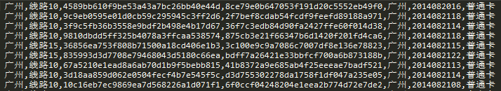
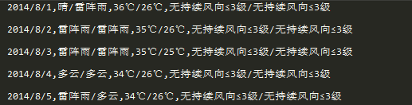
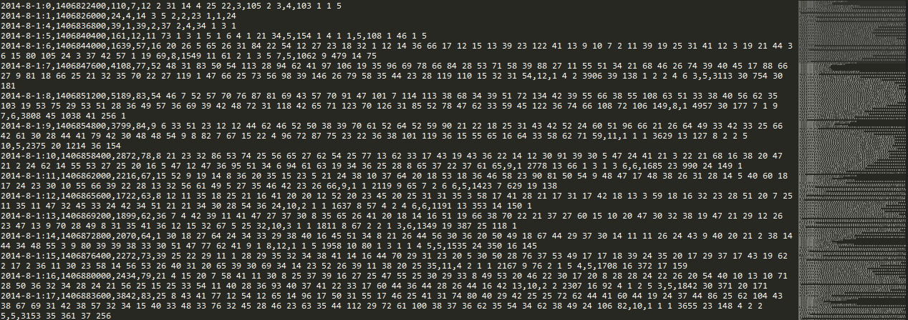
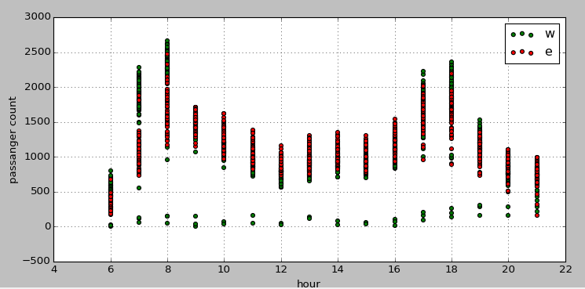
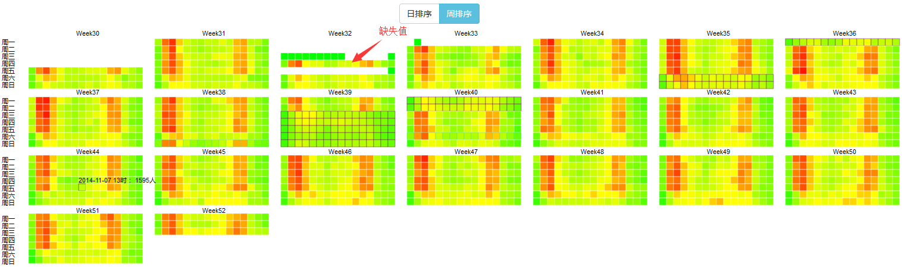
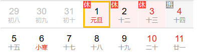
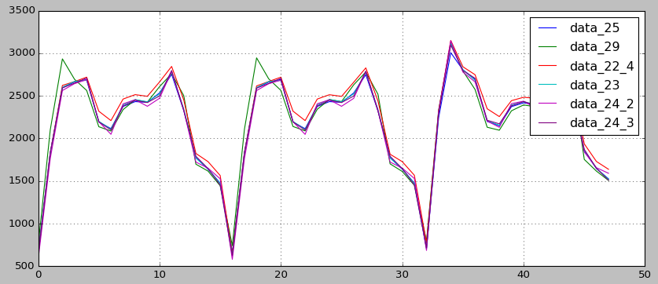
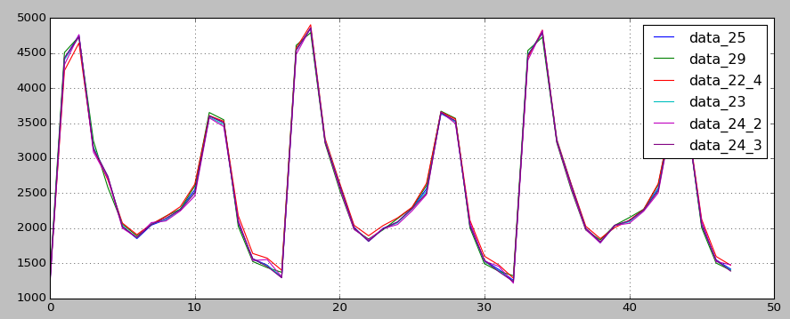

### 题目描述
比赛由岭南通公司提供的刷卡交通记录数据，要求选手挖掘市民在公共交通中的行为模式，去解决公交流量预测和市民出行公交线路选乘预测两个问题。

#### 数据描述
大赛开放20140801至20141231五个月广东部分公交线路岭南通用户刷卡数据，共涉及300多万用户7个线路3000多万条数据记录。同时大赛提供20140801至20150131期间广州市的天气状况信息。
##### 乘客刷卡交易数据表（ gd_train_data ）
<table>
<tr>
<td>列名</td>
<td>类型</td>
<td>说明</td>
<td>示例</td>
</tr>
<tr>
<td>Use_city</td>
<td>String</td>
<td>使用地</td>
<td>广州</td>
</tr>
<tr>
<td>Line_name</td>
<td>String</td>
<td>线路名称</td>
<td>线路名称</td>
</tr>
<tr>
<td>Terminal_id</td>
<td>刷卡终端ID</td>
<td>刷卡终端ID</td>
<td>193d6b838459b44c45f446a537d95447</td>
</tr>
<tr>
<td>Card_id</td>
<td>String</td>
<td>卡片ID</td>
<td>b988e22a768f684c65be2d141537f9cc</td>
</tr>
<tr>
<td>Create_city</td>
<td>String</td>
<td>发卡地</td>
<td>佛山</td>
</tr>
<tr>
<td>Deal_time</td>
<td>String</td>
<td>2014091008</td>
<td>2014091008</td>
</tr>
<tr>
<td>Card_type</td>
<td>String</td>
<td>卡类型</td>
<td>学生卡</td>
</tr>
</table>

##### 公交线路信息表（gd_line_desc）
<table>
<tr>
<td>列名</td>
<td>类型</td>
<td>说明</td>
<td>示例</td>
</tr>
<tr>
<td>Line_name</td>
<td>线路1</td>
<td>线路1</td>
<td>线路1</td>
</tr>
<tr>
<td>Stop_cnt</td>
<td>线路站点数量</td>
<td>线路站点数量</td>
<td>24</td>
</tr>
<tr>
<td>Line_type</td>
<td>String</td>
<td>线路类型</td>
<td>广州市内/广州佛山跨区域</td>
</tr>
</table>

##### 广州市天气状况信息（gd_weather_report）
<table>
<tr>
<td>列名</td>
<td>类型</td>
<td>说明</td>
<td>示例</td>
</tr>
<tr>
<td>Date_time</td>
<td>String</td>
<td>日期</td>
<td>2014/8/1</td>
</tr>
<tr>
<td>Weather</td>
<td>String</td>
<td>天气状况（白天/夜间）</td>
<td>晴/雷阵雨</td>
</tr>
<tr>
<td>Temperature</td>
<td>String</td>
<td>气温（最高/最低）</td>
<td>36℃/26℃</td>
</tr>
<tr>
<td>Wind_direction_force</td>
<td>String</td>
<td>无持续风向≤3级/无持续风向≤3级</td>
<td>无持续风向≤3级/无持续风向≤3级</td>
</tr>
</table>

#### 问题描述
利用上数据集，要求比赛选手分两个子比赛去解析两个问题：
1. 公交线路客流预测， 预测数据集为这些公交线路在20150101-20150107每个线路每日06时至21时各个小时段的乘车人次总和。
2. 市民出行公交线路选乘预测，预测数据集为前五个月出现的乘客在20150101-20150107期间会搭乘哪些公交线路。

#### 问题一：公交线路客流预测 解决方案
首先，问题一是一个回归问题，利用历史的客流信息去预测未来一个星期的客流。特征向量是每个小时下的特征，输出y值是当前小时的总流量。

在这个问题中需要预测两条公交线路（线路10和线路15）未来一个星期的流量，由于两个都是广佛跨区域线路，所以主要是对表一gd_train_data和表三gd_weather_report进行特征提取。gd_train_data中的数据记录如下：

* 全表Use_city都是广州，这个字段可以直接去除。
* Line_name有线路10和15，可以用一个roadList来存储。
```
	def _check_road(self,s):
          s=s.strip()
          s=s.replace(u'线路','')
          index=self.__roadList.get(s,-1)
          if index==-1:
               index=1
               self.__roadList[s]=index
          return s
```
* 字符串的Terminal_id，card_id，card_id，card_type可以重新用新的id来索引，日期改用timestamp的形式来表示。
 ```
def _check_bus(self,s):
          s=s.strip()
          index=self.__busList.get(s,-1)
          if index==-1:
               index=len(self.__busList)+1
               self.__busList[s]=index
          return index

     def _check_user(self,s):
          s=s.strip()
          index=self.__userList.get(s,-1)
          if index==-1:
               index=len(self.__userList)+1
               self.__userList[s]=index
          return index

     def _check_city(self,s):
          s=s.strip()
          index=self.__useCity.get(s,-1)
          if index==-1:
               index=len(self.__useCity)+1
               self.__useCity[s]=index
          return index

     def _check_date(self,s):
          date=datetime.strptime(str(s),'%Y%m%d%H')
          timestamp=time.mktime(date.timetuple())
          return int(timestamp)

     def _check_card(self,s):
          s=s.strip()
          index=self.__cardType.get(s,-1)
          if index==-1:
               index=len(self.__cardType)+1
               self.__cardType[s]=index
          return index
  
  ```
  
这一个步骤就可以将整个文件大大减少。在clean_data.py这个文件实现。
    
* 同样的，在gd_weather_report.txt这个表中，可以将天气信息转换为数值型来表示。在weather.py文件进行实现。其中，由于风向的信息区别不大，直接忽略没有进行统计。



然后，将各个线路的刷卡记录进行拆分，以便进行独立分析。在split_road_data.py完成。

接下来来到最关键的数据收集部分，在count_road_data.py中完成。
在_handle_count_data函数中，主要统计了以每个小时（timestamp）为行单位的统计信息，比如说每辆车的运载乘客数目，每个乘客单小时内乘车的次数，发卡城市乘客的数目，不同卡类型的乘客数目。经过这个统计，从sublime的缩略图中就可以看到一些有趣的信息。上班高峰期的客流比低峰期要大，所以公交发车的次数也相对多。右侧缩略图会看到不同时间段有不同峰值的情况。



经过统计，还发现有一些数据是不再6-21小时这个时间段以内的，所以需要把它过滤掉，在time_select.py中完成。

接下来，statistic_road_data.py进行路线的一下额信息统计：最多，最小，平均，中位载客量，最大值与最小值的差值，方差。
对路线的数据进行一定的可视化分析，可以更好地了解数据。从下图可以看到，每个小时在工作日和周末的时间分布。可以看到，工作日在上下班高峰期的峰值会比周末的要搞。而图表中有工作日下奇怪的全部为0-500之间的异常值，需要通过进一步的可视化分析探索原因。



我尝试通过像素矩阵的方式去更深入了解数据。将每个小时的乘客数作为一个像素单位进行颜色值得编码，如下：



从上面的颜色编码即可看到在8月11，13，15和18号的统计信息出行异常，应该将这几天的信息进行过滤。同时，从像素矩阵中，可以看到高峰期的乘客人数会比低峰期要多，工作日和周末有明显的不同。而节假日对每个小时乘客的数量又有影响。

to_regression.py实现对每个小时特征的分析，以天气信息一起形成特征向量。
###### 在_hour_data函数下统计的特征向量有：
* 当前小时所在周为一年的第几周：year_week
* 小时：hour（6-21）
* 周几：weekday
* 假期的第几天：continueHoliday（由于国庆假期7天和中期假期3天表现出来的乘客人数分布不同，所以假期的长短可能会影响客流）
* 是否为加班：isOverTime
* 是否为假期：isHoliday
* 时间戳：timestamp
* holiday_len：假期长度

###### 天气信息：
* 白天天气类型
* 夜间天气类型
* 白天温度
* 夜间温度

由此可得到13维的信息。比赛过程中即用此13维信息对未来一周的客流进行预测。但在特征方面可以进行更多的优化，比如天气类型进行离散化表示，当前的特征基本只用到本周信息，可以加入上几周的累计信息来丰富特征维度。

本次题目的一大难点在于如何构建合理的本地预测集。题目要求预测2015.1.1-1.7号七天的客流，其中1-3号休假，4号上班。而4号由是星期天。在本地的测试集中，只有中秋（9.6-9.8）和国庆（10.1-10.7）两个假期，而且两个假期的客流情况也不尽相同。那么本地训练测试的时候，如何将其中的某个假期的时间放入测试，都会在训练的时候损失一定的信息。而如何无差别的通过随机选取行数的方式来进行训练测试，又会与最终线上测试的结果不同。这个问题并没有的到很好的解决。



最后，贴几张不同回归模型下的预测图。可以看到，不同模型预测结果的主要区别在于1-3号的客流。这个题目比较坑，因为要预测7天X16个小时X2条线路=224个点，所以结果波动会比较大，即一个模型在一条线路上表现很好，但是换了一批数据，将有可能很差。我就遭遇了这个情况。在没有换数据集之前，rf可以排到前10名，而换数据之后，rf基本上是在百名开外了。晕。。。




