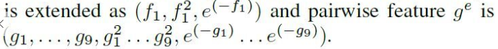
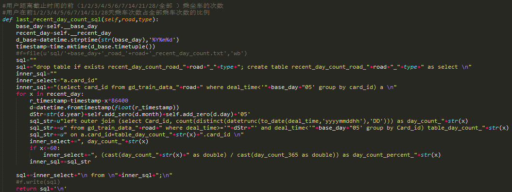
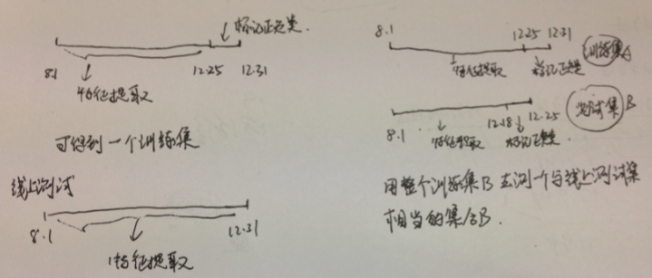
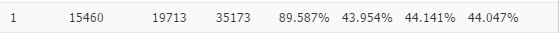
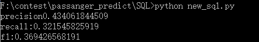
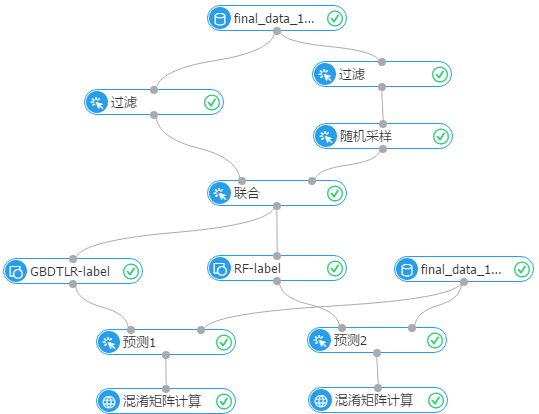

#### 问题二解决方案
问题一要根据乘客的历史信息判断其在未来一周是否再次乘坐此车。可以将这个问题归类为一个监督二分类问题。利用历史纪录判断其会乘车（类1）和不会乘车（类0）。
##### 特征提取：
由于整个实现的过程是在御膳房上面实现的，所以对用户特征的选取都是基于SQL去实现的。当然，也可以通过编写MapReduce的方式来提取特征，而我不是很想碰java maven那套难搞的东西，所以并没有在本地写MapReduce或者UDF，纯手工方式进行特征的提取。

前期主要在50维左右的特征进行训练，后面亚涛的加入和胡神给出的一些建议，可以使整个特征大大扩展。
###### 用户与线路交互特征：
* #用户距离截止时间的前（1/2/3/4/5/6/7/14/21/28/全部 ）乘坐车的次数
* #用户在前1/2/3/4/5/6/7/14/21/28天乘车次数占全部乘车次数的比例
* #层次方式获取数据 levels_dict={'2':14,'3':15,'7':10,'14':6,'21':4,'28':3} 以2，3，7，14，21，28天为周期提取不同长度区间是否乘车（boolean型）和乘车的数目（count型）
* #用户第一次与最后一次乘车时间，第一次与最后一次乘车时间的差值，最后一次与最后第二次的差值
* #用户所有路的第一次与最后一次乘车时间，第一次与最后一次乘车时间的差值，最后一次与最后第二次的差值
* #用户乘坐该车的次数(在recent_365已经统计)，总路线的次数，该车/总路线的比例
* #用户在不同天气下乘坐所有线路的次数 比例
* #用户在不同天气下乘坐一条线路的次数 比例
* #用户距离截止时间前1个月内每天乘车次数超过两次以上的次数，3,7,14,21,30天内换一种计算方法，多次计算减去一次计算的次数 （即乘车次数-乘车天数）
* #用户距离截止时间1，2，3，4个星期内，周一到周五乘车的次数，周六到周日乘车的次数，周一到周五占一周内乘车的比例。
* #用户上下班高峰期乘车次数与比例（8-10时，16-18时为高峰期）
* #发卡地与卡类型
* #第一次与最后一次乘车时间的差值，最后一次与最后第二次的差值，将差值变成离散类型表示
* #发卡地与卡类型变成离散类型表示

胡神的建议：

这种思想其实很简单，平方即是在原特征的基础上更加扩大特征值间的范围。而e的-g次方是变换特征到0-1之间，相当于一个正则化的过程。这个扩展可以增加特征的表达信息。

贴一下SQL代码，感受一下：

##### 训练集与测试集划分
在本地测试中，可以选取最后一个星期为标记训练集的时间（如2014.12.25-2014.12.30），而选取前面的时间作为训练集的特征提取（2014.8.1-2014.12.24）。而线上的测试就直接用整个数据集去测试。（2014.8.1-2014.12.31）。这样的做法是在一个训练集里面训练训练模型，通过判断目标类1的f1值是否到底最高为训练的目的。如图左。正类是在8.1-12.24时间内乘过车的用户又再次在12.25-12.31时间内乘车，即标为1，而未在这7天内乘车的用户标为0。

这个思想是有问题的，但是直到比赛的最后一天，才f1值提升不上去，才让我回想整个比赛的问题。问题在于线上测试的情况与模型训练的最好目标并不统一。即一个训练集内训练得到类1的F1值最高，并不等于线上测试的类F1值最高，因为要考虑到以下两个问题：
1. 我们是预测未来一周的情况，那么当训练集F1最高（通常是准确率P和召回率R相当），即F1=2*P*R（P+R）。而每周都会有不同的新用户加入乘车，即线上的测试集中R的值要比训练集要低。这就会造成P与R值相差较大，在线上得到一个较差的F1值。而到底R的值会降低多少呢？线上测试的准确率是否和线下一致呢？如果通过上述的训练测试方法是无从知道的。这就是为什么用这种方法，每条线路都会超过0.4甚至更高的F1值，而线上测试只有0.37左右。
2. 线上预测的是2015.1.1-2015.1.7号的用户是否会乘坐某线路。前面说到，这个时间段有元旦假期，车流量会受到节假日的影响。那么，应该对每个线路节假日的客流人数进行统计，看节假日影响的程度。

正确的训练测试方式应该如图右。本地测试集应该是一个和线上测试集相当的集合。把每周在前面历史纪录中没有出现过的新乘客也加入到P和R的统计当中。

从最后冲忙的统计可以得到，用训练集模型内得到的均衡类1的F1值，用整个类线上测试集进行测试时，会成为这样：
* 训练集内：

* 测试集：

由此可得，召回率R会比训练集内部的R要小很多，不能直接用训练集内部的一个类1F1最高的模型来直接应用到线上的测试集。而经过调整训练集模型内的R和R值，发现了另外一个特点。前面说到既然整个测试集的R会比训练集内部的R要小，那么可以适当的降低P值提高R值来达到线上较为均衡的结果。但是，实验发现，R的升和P的降并不是对等的，即是要提升1%的R值，有可能要降低3%或者更多的P值。如何去调整训练集内部的P值和R值，让测试集的P值和R值达到均衡，或者是F1值达到最高，需要进行调试。而前面也提到，假期的影响，会使线路乘车的人数有可能减少，那么这样原来在正常的情况下坐车的人有可能不坐车，而有些假日出行的乘客就也会影响结果。这样会造成线上测试的P值有可能会是训练集内部的P值要高。所以要取得一个高的F1值，除了模型本身的分类效果要好，另外一个就是如何去调整一个P和R值，使线上的P值达到最高。

##### 模型
整个算法模型的实现是在御膳房上运行的，我本身并没有在MapReduce上实现算法。根据御膳房的发展历史，其算法平台的工具应该是在Xlab的基础上实现的，而Xlab是基于Python实现的，所以应该和本地的差不多，都是利用现成的算法去调整参数。感受一下算法平台的可视化操作：

需要写的一方面是关于样本的选取。因为整个数据集有：
* 新路线用户：
  * 线路21,996555
  * 线路13,203675
  * 线路16,801981
  * 线路19,528281
  * 线路6,1619278
  * 线路9,1486270
  * 线路11,1951351
* 新路线记录分布：
	* 线路21,3065655
    * 线路13,1023494
    * 线路16,3273369
    * 线路19,2446734
    * 线路6,4857644
    * 线路9,5223363
    * 线路11,6738391

最少的数据集都有20W的用户，而且类1和类0的数目极为不均衡，大概是1：0=1：10。如果直接将数据集放入模型训练，那么得到的类1的召回率将会很低。一是可以对正类类1进行上取样，增加正样本的数目；二是可以对负类类0进行下采样。比赛中最终采取的是对负样本进行下取样的方法。因为对正样本上取样会大大增加整个数据集的大小，会耗费过多资源。同时，我们目标是要增加类1的F1值，所以，仅仅通过上取样增加正类的数目并不一定会增加F1值，同时，由于负样本数目众多，下取样不会很明显降低负样本的描述。通常是对负样本随机取样0.3可以得到一个均衡的P和R值。

###### 值得讨论的几个点：
1. 是否应该过滤掉在训练集中仅出现过1次的用户

	即在整个2014.8.1-2014.21.31时间段内，这些用户仅仅在各个线路乘坐过一次公交车。这样的用户数目不在小数，而是非常多。
	
    p2_gd_train_data 用户：4440906

	去除记录为1的用户：2908563  直接去除 1 532 343！用户

	去掉记录为1的用户可以直接去除150W+的用户。而且，记录为1的用户是负类的用户。因为他在这个数据集中只出现过一次，所以不可能被标记为类1。这里相当于对负样本进行一个预删除的处理，正类的数目并不会减少。所以删除了记录为1的用户后，本地训练集内部的测试的准备率会提升4%左右。但，如果在一开始就对150W+的用户进行删除，那么是否会损失掉这部分用户的推荐？这是个值得考虑的问题。
2. ensemble的手工实现，用惯了scikit-learn的模块，那么多级模型下的ensemble到底是怎么实现呢？

	最简单的实现，voting，对多个模型的输出结果进行投票。其他的如bagging和boost的方式，应该在过后自己再实现一次。

3. 关于每条线路的应该提交多少名正例人数
    * 11-174758
    * 13-22049
    * 16-64376
    * 19-46218
    * 21-77314
    * 6-120270
    * 9-128929
    
	以上是以12.25到12.31为正类的标记区间所标记的各个线路的正类数目。那么，如果不考虑节假日的影响，那么每个路线所标记的正类数目应该和上面的相差不远。考虑节假日影响，可能会比平时稍微低一点。那么，在对线上的测试集进行预测的时候，应该得到的预测结果与上述标记的正类结果相差不大才让线上的预测结果与本地的结果一致。而基于这个考虑，我们可以将分类问题变换为一个回归问题，计算每个乘客可能乘坐每条线路的分数，然后选择TopN来作于预测的结果。

